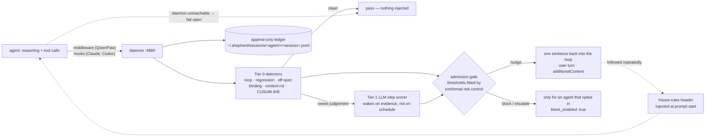

# agent-shepherd

[](https://github.com/CallMeHFK/agent-shepherd/actions)


A supervisor that watches an AI coding agent *while it works* and injects one
short corrective sentence when it drifts — mid-loop, before the next wasted tool
call, not in a review afterwards.

Two tiers do that work. **Tier 0** is deterministic detectors that run on every
event at zero cost: they never call a model and never guess. **Tier 1** is an
optional LLM step scorer that scores recent steps for on-goal / justified /
verified, and only wakes when Tier 0 has seen evidence — so the expensive
reviewer is asleep while the agent is healthy. A verdict is admitted through a
risk gate fitted from observed outcomes, not through whatever confidence the
judge self-reported.

It supervises **QwenPaw**, **Claude Code** and **Codex**, appends an auditable
ledger of everything it saw, and ships an offline counterfactual benchmark so
"is it worth its cost?" is a command you can run rather than a claim in a README.

- [Quick start](#quick-start)
- [How it works](#how-it-works)
- [What it catches](#what-it-catches)
- [Adapters](#adapters)
- [Judge backends](#judge-backends)
- [Configuration](#configuration)
- [Audit and replay](#audit-and-replay)
- [Measuring it](#measuring-it)
- [Running it as a service](#running-it-as-a-service)
- [Troubleshooting](#troubleshooting)
- [Development](#development)

## Quick start

```bash
# the supervisor. not on PyPI; install from the repo (or `uv pip install -e .` in a checkout)
uv pip install "git+https://github.com/CallMeHFK/agent-shepherd.git@v0.2.0"

shepherd start-bg              # daemon on 127.0.0.1:4890; writes ~/.shepherd/config.yaml on first start
shepherd install qwenpaw       # or: claude | codex — writes hooks, never clobbers them blind
shepherd doctor                # what is configured, what is missing, what to do next
```

Restart the agent you just hooked. Then check the two things that matter:

```bash
shepherd status                # up — and which checkout the code was loaded from
shepherd stats qwenpaw <session-id>   # after a session: what it saw, what it cost
```

Tier 0 needs no model and no key: with no judge reachable, the detectors still
run and the benchmark still scores them (that is exactly what CI does). Adding a
judge buys the second tier — see [Judge backends](#judge-backends).

## How it works



Three edges in that picture are the design:

* **Fail open.** An unreachable supervisor is invisible, never fatal. No adapter
  call to the daemon is allowed to raise, and hooks are built so a crash on the
  shepherd side cannot break your agent.
* **Injection, not logging.** A nudge becomes a new user turn (QwenPaw's
  `INTERRUPT_AND_CONTINUE`) or `hookSpecificOutput.additionalContext` (the hook
  adapters). The agent reads it as its own context, at the point where it still
  changes what happens next.
* **Evidence spends the budget.** The judge is woken at natural checkpoints and,
  mid-iteration, only as the drift statistic climbs toward its alarm line — never
  on a schedule.

## What it catches

Tier 0 signals, all deterministic and all free:

| Signal | What it actually sees | Default | Knobs |
| --- | --- | --- | --- |
| `loop` | the same tool call ≥ 3× in a sliding window of 8, exact or near-duplicate (token Jaccard ≥ 0.7, same tool name) | on | fixed constants in `core/rules/detectors.py` |
| `regression` | a `pytest`/`lint`/`build`-shaped command that succeeded earlier in *this* session and now fails | on | — |
| `offspec` | an edit outside the session's delegation contract: the path was never named in the goal, matched by an allow-glob, or already seen this session | deny-globs block; nudging on merely-unobserved paths is **off** | `scope_deny_globs`, `scope_allow_globs`, `scope_nudge_unobserved` |
| `binding` | right tool, wrong entity — acting on a near-miss sibling of the file you resolved (similarity judged on the *filename*, so `test_x.py` vs `x.py` is not a confusable pair) | on | `binding_enabled`, `binding_similarity` (0.6) |
| `contextrot` | long reasoning with no tool activity for ≥ 60 s of wall clock, i.e. spinning rather than streaming | on | `min_quiet_seconds` (constructor default) |
| `drift` | a CUSUM alarm over the outcome stream, with the alarm line calibrated by Monte-Carlo to a false-alarm budget over a session-length horizon and a self-starting per-session baseline | on | `drift_enabled`, `drift_target_fpr`, `drift_horizon`, `drift_adaptive_baseline`, `drift_watch_fraction`, `drift_unknown_weight` |

Cross-cutting machinery that is not a detector but changes what you experience:

| Mechanism | What it does | Knobs |
| --- | --- | --- |
| outcome classification | every tool result is *failed / ok / unknown* from structured evidence (exit codes, failure hooks) before any text is pattern-matched, so `grep error logs/x` is not a failure and a lost response is not a success | `drift_unknown_weight` weights `unknown` below `failed` |
| anti-nagging | repeat nudges from the same detector are suppressed inside a cooldown; blocks and escalations never are | `nudge_cooldown_seconds` |
| wake gate | clean iteration boundaries are not reviewed at all, because measured cost was ~23 % of all events waking a judge on healthy sessions | `review_clean_iterations` |
| admission | the two score thresholds are priors until enough labelled outcomes accumulate, then conformal risk control replaces them with a finite-sample fit; a key with too little evidence is dropped rather than pinned to a fallback | `nudge_threshold`, `block_threshold`, `risk_target_fpr`, `risk_min_samples` |
| rulebook | guidance the agent demonstrably followed is promoted into a short header at prompt start instead of re-nagged mid-run | `rulebook_enabled`, `rulebook_budget_tokens` |

The derivations, the papers behind them and the negative results are in
[RESEARCH_NOTES.md](RESEARCH_NOTES.md).

## Adapters

### QwenPaw — in-process plugin, highest fidelity

```bash
shepherd install qwenpaw
```

Copies the bundle to `~/.qwenpaw/plugins/agent-shepherd`; restart QwenPaw to
load it. The plugin registers an agentscope `MiddlewareBase` that observes every
reasoning delta and tool call in-process, plus a `StopGate` that asks the daemon
for a verdict at each ReAct iteration boundary and injects guidance as a new user
turn. A zero-install REST/SSE fallback
(`agent_shepherd.adapters.qwenpaw.rest_client.QwenPawRestClient`) observes
`127.0.0.1:19999` and resolves Tool Guard approvals instead.

#### Import it from a release instead of a checkout

Every `v*` release attaches the bundle as a zip named after the plugin, so an
agent can install it without this repository anywhere on disk:

```bash
qwenpaw plugin install \
  https://github.com/CallMeHFK/agent-shepherd/releases/download/v0.2.0/agent-shepherd.zip
```

`.../releases/latest/download/agent-shepherd.zip` is the same position for
whoever wants to stay current — the version the host displays comes from the
`plugin.json` inside, not from the filename. A local path works identically
(`qwenpaw plugin install agent-shepherd.zip`), and so do the app's plugin routes:
upload the zip, or hand it the URL. Running QwenPaw hot-loads it; a stopped one
loads it on the next start. The archive holds exactly what `shepherd install
qwenpaw` writes — including a `README.md` that says what the bundle does *not*
bring — and a test asserts the two trees cannot drift apart.

Two ways this fails quietly:

* **Not the source archive.** GitHub's auto-generated
  `.../archive/refs/tags/v0.2.0.zip` unpacks to `agent-shepherd-0.2.0/` with no
  `plugin.json` where the installer looks, and is rejected.
* **A bundle is not a supervisor.** The zip is the observer only; it POSTs to
  `127.0.0.1:4890` and fails open when nothing listens there, so it loads,
  registers, and supervises nothing.

### Claude Code

```bash
shepherd install claude
```

Writes `PreToolUse` / `PostToolUse` / `Stop` / `UserPromptSubmit` hooks into
`~/.claude/settings.json`. The hook thin-shell (`shepherd-hook claude`)
translates a verdict into Claude Code's `hookSpecificOutput.additionalContext` /
`decision`.

### Codex CLI

```bash
shepherd install codex
```

Writes the same events into `~/.codex/hooks.json` using the Codex-specific
schema: a top-level `hooks` map of matcher groups with `{"type": "command"}`
handlers.

**Hook trust.** Codex only runs hooks persisted as trusted. In the interactive
TUI it prompts the first time it sees them; approve once and later sessions run
them. Non-interactive `codex exec` **silently skips** untrusted hooks, so
automation has to opt out of the persisted trust explicitly:

```bash
codex exec --skip-git-repo-check --dangerously-bypass-hook-trust "..."
```

Installing any adapter is conservative: the previous `settings.json` /
`hooks.json` is copied to a timestamped `.bak` first, an unparseable existing
file is refused rather than replaced, foreign hook groups are left alone, and a
previous QwenPaw bundle is moved to `~/.qwenpaw/plugin-archive/` instead of
being deleted.

## Judge backends

The judge is any OpenAI-compatible chat endpoint. The default is Agnes
(`agnes-3.0-flash` via the Agnes AI Hub); a local gateway needs no key at all —
leave `SHEPHERD_JUDGE_API_KEY` unset and no `Authorization` header is sent, and
loopback/LAN endpoints bypass proxy environment:

```bash
export SHEPHERD_JUDGE_BASE_URL=http://127.0.0.1:19991/v1
export SHEPHERD_JUDGE_MODEL=<name from that endpoint's /v1/models>
```

`shepherd config judge` lists the model names the configured endpoint actually
accepts, which beats guessing one.

## Configuration

One human-editable file, `~/.shepherd/config.yaml`, written on the daemon's
first start. You are not meant to hold it in your head: every setting has an
owner (`file`, `env:NAME`, or `default`) and the CLI says which.

```bash
shepherd doctor                          # entry point: adapter paths, judge reachability, daemon, thresholds
shepherd config show                     # every effective setting and where its value came from
shepherd config set policy.drift_watch_fraction 0.5    # one setting, no editor
shepherd config merge                    # add settings an older config file predates
shepherd config prune                    # drop settings this release no longer reads
shepherd risk                            # which admission thresholds are in force, prior or calibrated
```

`judge.*` also reads `SHEPHERD_JUDGE_BACKEND` / `_BASE_URL` / `_MODEL` /
`_API_KEY` / `_TIMEOUT`, which override the file; `${VAR}` inside the file is
expanded, and an unset variable resolves to empty rather than to the literal
text. Keys retired by a release are reported `STALE` by `doctor` instead of
being silently ignored, because a dead setting in a config file looks exactly
like a live one.

<details>
<summary>The starter config, in full</summary>

```yaml
judge:
  backend: agnes
  base_url: https://apihub.agnes-ai.com/v1
  model: agnes-3.0-flash
  api_key: ${SHEPHERD_JUDGE_API_KEY}
  timeout: 30
policy:
  nudge_threshold: 0.6          # admission prior; replaced by a conformal fit once outcomes accumulate
  block_threshold: 0.85
  max_guidance_tokens: 500
  fail_open: true
  nudge_cooldown_seconds: 300
  drift_enabled: true
  drift_target_fpr: 0.05        # budget over drift_horizon re-checks, not one window
  drift_horizon: 120
  drift_adaptive_baseline: true
  drift_watch_fraction: 0.6     # wake the judge this far below the alarm line
  drift_unknown_weight: 0.75    # a lost response counts 75% as much as a failure
  review_clean_iterations: false
  binding_enabled: true
  binding_similarity: 0.6
  scope_nudge_unobserved: false # ~1 false nudge per healthy session, and new test files trip it
  scope_allow_globs: []
  scope_deny_globs: ["*.env", "*.pem", ".git/*", "*.secret*"]
  risk_target_fpr: 0.05
  risk_min_samples: 20
  rulebook_enabled: true
  rulebook_budget_tokens: 160
agents:
  qwenpaw: {enabled: true, block_enabled: false}
  claude:  {enabled: true, block_enabled: false}
  codex:   {enabled: true, block_enabled: false}
port: 4890
```

`block_enabled` is per agent and defaults to off: guidance is advisory until an
agent asks to be stopped.

</details>

## Audit and replay

Every observation and verdict is appended to
`~/.shepherd/sessions/<agent>/<session>.jsonl` — append-only, never rewritten.

```bash
shepherd replay qwenpaw <session-id>
shepherd tail qwenpaw <session-id>
shepherd stats claude <session-id>     # events, judge calls, judge tokens, nudges, suppressions
```

`stats` is what makes the cost question answerable per session instead of per
hunch.

## Measuring it

```bash
shepherd eval --seed 7 --sessions 8 --steps 60 --fail-under-f1 0.6
```

`eval` runs an offline counterfactual benchmark: scripted healthy sessions plus a
fault injector that breaks exactly one thing at a known step, scored for
per-detector precision and recall, first-detection attribution, detection delay
in steps, false-alarm rate and supervision cost. It is deterministic, offline,
Tier-1 stubbed, and runs in CI as a gate — a threshold change that makes the
supervisor nag healthy sessions fails the build.

Because the benchmark knows by construction whether a session drifted, it is also
the only place the admission thresholds can be fitted against a real label:

```bash
shepherd eval --judge --fit-risk [path]
```

Fitting from live sessions uses a weaker label — "did a Tier 0 detector also
confirm drift" — which trains the judge to agree with the detectors rather than
to be right.

## Running it as a service

```bash
shepherd start              # foreground
shepherd start-bg           # detached; writes ~/.shepherd/daemon.pid and daemon.log
shepherd status             # up / down — down means supervision is silently failing open
shepherd stop               # SIGTERM the start-bg process
```

For a machine that should always be supervising, a systemd user unit ships with
the repo (no root required). It is deliberately *not* enabled by the installer:
turning on a background process that injects text into your agents is your
decision, not a side effect of `pip install`.

```bash
install -Dm644 packaging/shepherd.service ~/.config/systemd/user/shepherd.service
systemctl --user daemon-reload && systemctl --user enable --now shepherd
```

The first start pays the drift detector's Monte-Carlo threshold fit (a few
seconds) before it binds; the result is cached in
`~/.shepherd/cusum_thresholds.json`, so later starts bind immediately.

## Troubleshooting

| Symptom | Cause and check |
| --- | --- |
| Agents behave exactly as before | `shepherd status` — while the daemon is down every adapter fails open, which is by design and completely silent |
| A new feature looks broken | `shepherd status` prints `code loaded from:`. Two checkouts can both be installed and the winner depends on the working directory |
| Nudges never arrive even though the plugin loads | QwenPaw was not restarted after the install, or a second copy of the bundle is in the scan path: `ls ~/.qwenpaw/plugins/ \| grep agent-shepherd` must print exactly one line |
| `codex exec` shows no supervision | untrusted hooks are skipped without warning; pass `--dangerously-bypass-hook-trust` |
| Hook calls raise `ImportError` about SOCKS | proxy environment leaking into loopback calls; daemon calls must use `trust_env=False` |
| A config edit does nothing | `shepherd config show` — the `source` column says whether a `file` key is being overridden by an `env:` one, and `doctor` flags keys this release no longer reads |

## Development

```bash
uv sync --all-extras && uv run python -m pytest -q && uv run ruff check .
```

Use `python -m pytest`, not a bare `pytest`: if the dev extras are not installed,
a bare `pytest` can resolve from outside this environment and import a *stale
installed copy* of the package, reporting green tests against code that is no
longer on disk.

[CONTRIBUTING.md](CONTRIBUTING.md) covers the development setup, the
detector/adapter conventions, commit and PR guidelines, and the strict
no-real-secrets rule. Interactions are governed by the
[Code of Conduct](CODE_OF_CONDUCT.md). Release artifacts and their rationale are
on [the releases page](https://github.com/CallMeHFK/agent-shepherd/releases);
design decisions and the literature behind them are in
[RESEARCH_NOTES.md](RESEARCH_NOTES.md).

## License

MIT
